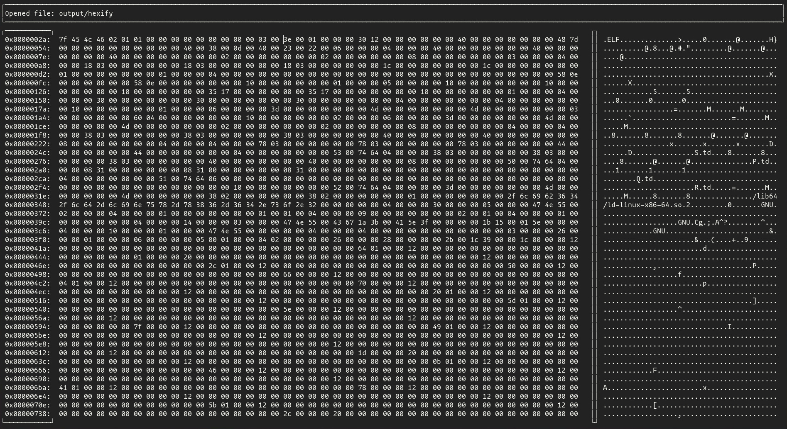

# hexify
is a program for displaying files in hex and also giving an ascii letter to each hex number in a nice terminal gui.
## Description


## Usage
hexify currently only has 2 ways to open a file.
- hexify \<file-name>
- hexify -f \<file-name>

### Other flags
- hexify -r \<float> `Bigger = more ascii characters (0-1)`
- hexify -h
- hexify -v 

There are two more flags `-v` and `-h` but they aren't very usefull currently.

### Dependencys
`ncurses`

For cloning
`git clone https://github.com/DevManu-de/hexify.git --recursive`

### Compilation
`make`

An executable will appear in the `output` directory.

If you see
```
make: ctags: No such file or directory
make: *** [Makefile:35: hexify] Error 127
```
dont worry the executable was still created but Makefile couldn't find `ctags`.
